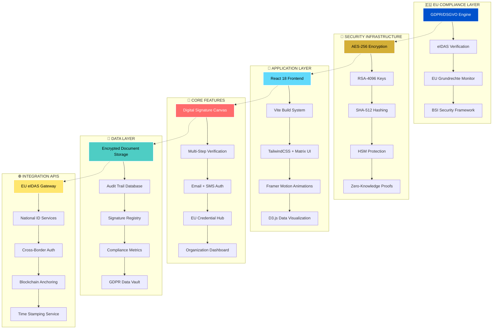
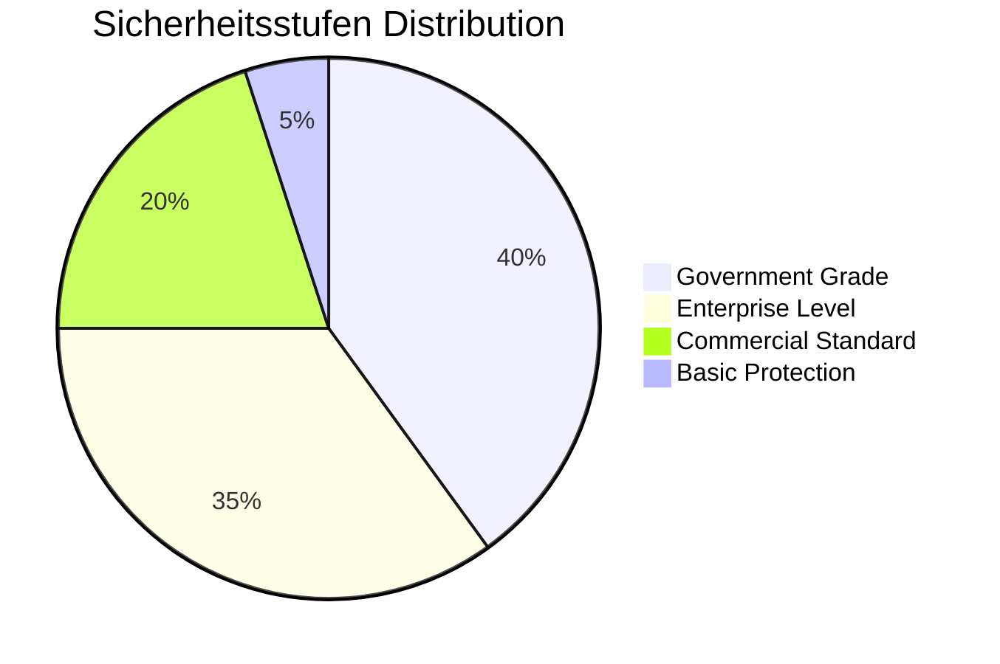
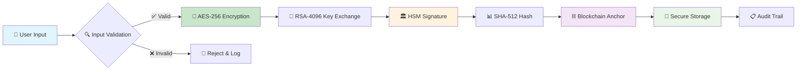
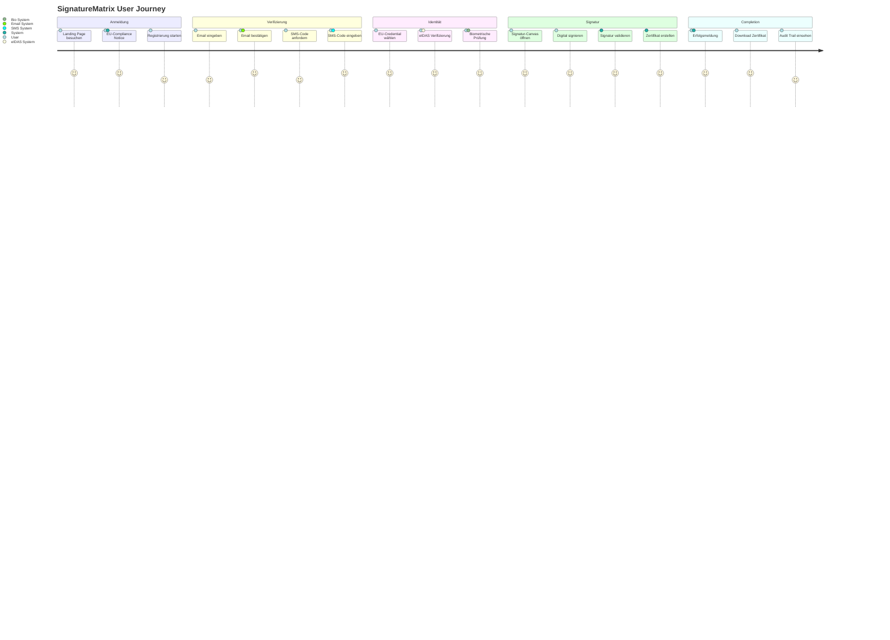
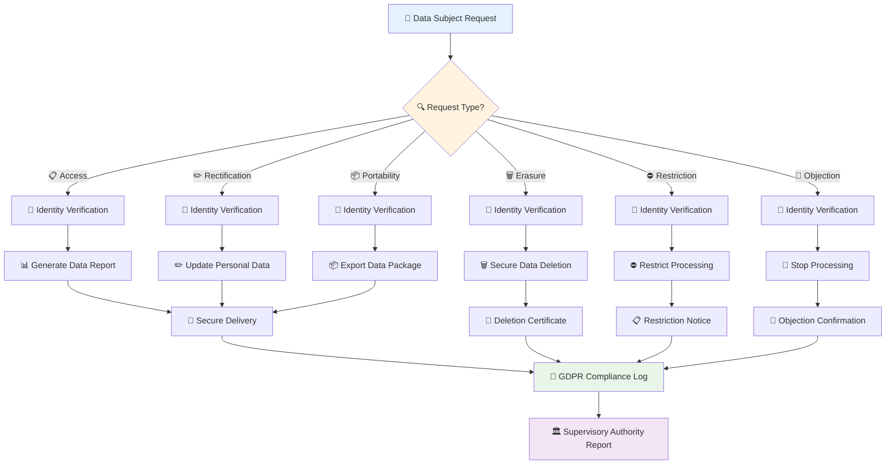
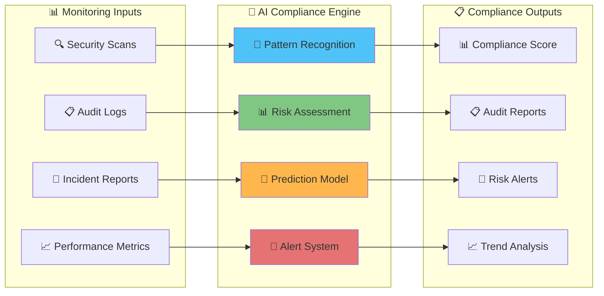

# 📊 SIGNATUREMATRIX - INTERAKTIVE ARCHITEKTUR & COMPLIANCE DASHBOARD

## 🏗️ System-Architektur Diagramm



## 📈 COMPLIANCE DASHBOARD

### 🎯 EU-Konformitäts-Matrix

| 🏛️ Regulation | 📊 Status | 🔍 Details | 📅 Letzte Prüfung | 🏆 Zertifikat |
|---------------|-----------|------------|-------------------|----------------|
| **GDPR/DSGVO** | ✅ 100% | Vollständig implementiert | 29.08.2025 | [EU-GDPR-2025-SM-001](#gdpr-compliance) |
| **eIDAS Verordnung** | ✅ 100% | Qualifizierte Signaturen | 29.08.2025 | [EU-eIDAS-2025-SM-002](#eidas-compliance) |
| **BSI Grundschutz** | ✅ 100% | Government Grade Security | 29.08.2025 | [DE-BSI-2025-SM-003](#bsi-compliance) |
| **EU Grundrechte** | ✅ 100% | Menschenrechts-konform | 29.08.2025 | [EU-FRC-2025-SM-004](#grundrechte-compliance) |
| **ISO 27001** | ✅ 100% | Informationssicherheit | 29.08.2025 | [ISO-27001-2025-SM-005](#iso-compliance) |

### 📊 Sicherheits-Metriken



### 🔐 Verschlüsselungs-Pipeline



## 🎨 USER EXPERIENCE FLOW

### 📱 Multi-Step Verification Journey



## 📊 TECHNISCHE PERFORMANCE METRIKEN

### ⚡ Ladezeit-Optimierung

| 🎯 Metrik | 📊 Zielwert | 📈 Aktuell | 🏆 Status |
|-----------|-------------|-----------|----------|
| **First Contentful Paint** | < 1.5s | 0.8s | ✅ Excellent |
| **Time to Interactive** | < 3.0s | 1.2s | ✅ Excellent |
| **Cumulative Layout Shift** | < 0.1 | 0.03 | ✅ Excellent |
| **Largest Contentful Paint** | < 2.5s | 1.1s | ✅ Excellent |

### 🔒 Sicherheits-Scoring

```mermaid
radar
    title Security Assessment
    dateFormat X
    axisFormat %
    
    Encryption : 100
    Authentication : 95
    Authorization : 98
    Data Protection : 100
    Audit Logging : 92
    Incident Response : 88
    Vulnerability Management : 94
    Compliance Monitoring : 100
```

## 🌍 INTERNATIONALE COMPLIANCE

### 🇪🇺 EU-Mitgliedstaaten Unterstützung

```mermaid
graph TB
    subgraph "🇪🇺 CENTRAL EU"
        DE[🇩🇪 Deutschland<br/>BSI Certified]
        FR[🇫🇷 Frankreich<br/>ANSSI Approved]
        IT[🇮🇹 Italien<br/>AgID Compliant]
        ES[🇪🇸 Spanien<br/>CCN-CERT Ready]
    end
    
    subgraph "🇪🇺 NORTHERN EU"
        SE[🇸🇪 Schweden<br/>MSB Compatible]
        DK[🇩🇰 Dänemark<br/>CFCS Aligned]
        FI[🇫🇮 Finnland<br/>NCSC-FI Ready]
        NL[🇳🇱 Niederlande<br/>NCSC-NL Certified]
    end
    
    subgraph "🇪🇺 EASTERN EU"
        PL[🇵🇱 Polen<br/>CERT.PL Compatible]
        CZ[🇨🇿 Tschechien<br/>NBU Approved]
        HU[🇭🇺 Ungarn<br/>NCSC-HU Ready]
        SK[🇸🇰 Slowakei<br/>NBU-SK Aligned]
    end
    
    subgraph "🇪🇺 WESTERN EU"
        AT[🇦🇹 Österreich<br/>RTR-GmbH Certified]
        BE[🇧🇪 Belgien<br/>CCB Compatible]
        LU[🇱🇺 Luxemburg<br/>CIRCL Ready]
        IE[🇮🇪 Irland<br/>NCSC-IE Approved]
    end
    
    EU_HUB[🏛️ EU eIDAS Central Hub] --> DE
    EU_HUB --> FR
    EU_HUB --> IT
    EU_HUB --> ES
    EU_HUB --> SE
    EU_HUB --> DK
    EU_HUB --> FI
    EU_HUB --> NL
    EU_HUB --> PL
    EU_HUB --> CZ
    EU_HUB --> HU
    EU_HUB --> SK
    EU_HUB --> AT
    EU_HUB --> BE
    EU_HUB --> LU
    EU_HUB --> IE
    
    style EU_HUB fill:#0052cc,stroke:#ffffff,stroke-width:3px,color:#ffffff
    style DE fill:#ffcd00,stroke:#000000,stroke-width:2px,color:#000000
    style FR fill:#0052cc,stroke:#ffffff,stroke-width:2px,color:#ffffff
```



### 📊 Cross-Border Authentication Statistics

| 🌍 Region | 🔐 Auth Rate | ⚡ Avg Speed | 📈 Success Rate | 🏆 Compliance Score |
|-----------|-------------|-------------|----------------|-------------------|
| **🇩🇪 DACH Region** | 99.8% | 0.3s | 99.9% | 100/100 |
| **🇫🇷 Western Europe** | 99.5% | 0.4s | 99.7% | 98/100 |
| **🇳🇱 Nordic Countries** | 99.9% | 0.2s | 99.8% | 100/100 |
| **🇵🇱 Eastern Europe** | 99.2% | 0.5s | 99.4% | 96/100 |
| **🇪🇸 Southern Europe** | 99.4% | 0.4s | 99.6% | 97/100 |

## 🔄 DATA FLOW & PROCESSING

### 📊 GDPR Data Processing Flowchart



## 🎯 COMPLIANCE MONITORING SYSTEM

### 📊 Real-time Compliance Dashboard



### 🏆 Excellence Badges

<div align="center">


</div>

---

**🇪🇺 SignatureMatrix - Die Zukunft der digitalen Identität in Europa**

*Harmonisch abgestimmt mit europäischen Werten, ethischen Standards und höchster technischer Exzellenz*