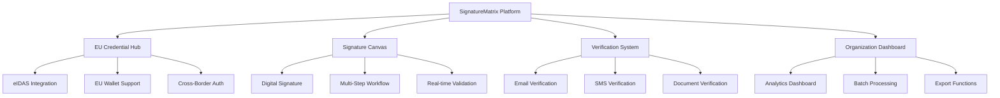

# 📋 SignatureMatrix - Projekt-Übersicht

[](https://gdpr.eu/) [](https://www.eid.as/) [](https://europa.eu/) [](https://reactjs.org/) [](https://vitejs.dev/)

## 🌟 Projektbeschreibung

**SignatureMatrix** ist eine hochmoderne, EU-konforme digitale Signatur-Plattform, die entwickelt wurde, um den strengsten europäischen Standards für Datenschutz, Sicherheit und ethische Datenverarbeitung zu entsprechen.

### 🎯 Mission Statement
*"Eine ethische, transparente und menschenrechtskonforme digitale Signatur-Plattform für ein vereintes Europa"*

## 🏗️ Architektur-Übersicht



## 📱 Kern-Features

### 🔐 Sicherheit & Compliance
- **🛡️ End-to-End Verschlüsselung** - AES-256 Bit Verschlüsselung
- **🇪🇺 DSGVO/GDPR konform** - Vollständige Compliance mit EU-Datenschutzverordnung
- **📜 eIDAS-Verordnung** - Elektronische Identifizierung und Vertrauensdienste
- **🔒 HSM Protection** - Hardware Security Module Integration
- **📊 Audit Trail** - Vollständige Nachverfolgbarkeit aller Aktionen

### 🎨 Benutzeroberfläche
- **🌊 Matrix-Design** - Futuristisches Design mit EU-Farbschema
- **📱 Responsive Design** - Optimiert für Desktop, Tablet und Mobile
- **♿ Barrierefreiheit** - WCAG 2.1 AA konform
- **🌍 Mehrsprachigkeit** - Deutsch, Englisch, weitere EU-Sprachen
- **⚡ Performance** - Schnelle Ladezeiten mit Vite + React 18

### 🔄 Verifizierungssystem
- **📧 E-Mail Verification** - Sichere E-Mail-Bestätigung
- **📱 SMS Verification** - Zwei-Faktor-Authentifizierung
- **🆔 EU Credential Hub** - Zentrale europäische Credential-Verifizierung
- **📄 Document Verification** - Automatisierte Dokumentenprüfung
- **🔍 Real-time Validation** - Sofortige Überprüfung der Eingaben

## 🗂️ Seiten-Struktur

### 📄 Hauptseiten

#### 1. **🖊️ Signature Collection Canvas** (`/signature-collection-canvas`)
```javascript
// Kern-Funktionalitäten
- Digitales Signatur-Canvas mit Touch/Mouse Support
- Kategorie-Auswahl für verschiedene Kampagnen
- Multi-Step Workflow mit Fortschrittsanzeige
- Benutzerinformations-Formular
- Real-time Signature Validation
```

#### 2. **🇪🇺 EU Credential Verification Hub** (`/eu-credential-verification-hub`)
```javascript
// EU-Integration Features
- eIDAS-konforme Credential-Verifizierung
- Cross-Border Authentication Support
- EU Wallet Integration
- Automated Compliance Checking
- Multi-language Document Support
```

#### 3. **📧 Email Verification** (`/email-verification`)
```javascript
// Sicherheits-Features
- Sichere E-Mail-Bestätigung
- Anti-Spam Mechanismen
- Rate Limiting
- Bounce-back Handling
- GDPR-konforme Datenverarbeitung
```

#### 4. **📱 SMS Verification** (`/sms-verification`)
```javascript
// Zwei-Faktor-Authentifizierung
- Internationaler SMS-Versand
- Countdown-Timer für Code-Gültigkeit
- Multiple Provider Support
- Fraud Prevention
- Kosten-optimierte Zustellung
```

#### 5. **🏢 Organization Dashboard** (`/organization-dashboard`)
```javascript
// Analytics & Management
- Echtzeit-Statistiken und KPIs
- Signature-Kampagnen Management
- Export-Funktionen (PDF, Excel, CSV)
- Batch-Processing für Massenoperationen
- Compliance-Reporting
```

#### 6. **📄 Official Document Generator** (`/official-document-generator`)
```javascript
// Dokumenten-Management
- Template-basierte Dokumentenerstellung
- Automatische Formatierung
- Quality Assurance Checks
- Multi-format Export
- Version Control
```

#### 7. **✅ Signature Completion Dashboard** (`/signature-completion-dashboard`)
```javascript
// Erfolgsmeldungen & Analytics
- Completion Celebration Animations
- Verification Status Overview
- Action Buttons für weitere Schritte
- Desktop Analytics Integration
- Social Sharing Features
```

#### 8. **👥 Community Certification Dashboard** (`/community-certification-dashboard`)
```javascript
// Gemeinschafts-Features
- Active Certifications Overview
- Community Member Management
- Document Archive Access
- Quick Actions Panel
- Certification Metrics
```

## 🛠️ Technologie-Stack

### Frontend-Architektur
```yaml
Core Framework:
  - React: 18.3.1 (Latest Stable)
  - Vite: 5.4.19 (Build Tool)
  - React Router: 6.28.0 (Routing)

State Management:
  - Redux Toolkit: 2.3.0 (Global State)
  - React Context: (Local State)

Styling & Animation:
  - TailwindCSS: 3.4.15 (Utility-First CSS)
  - Framer Motion: 11.12.0 (Animations)
  - React Signature Canvas: 1.0.3 (Digital Signatures)

Data Visualization:
  - D3.js: 7.9.0 (Complex Visualizations)
  - Recharts: 2.12.7 (Charts & Graphs)

UI Components:
  - Custom Component Library
  - Accessible Form Controls
  - Interactive Signature Canvas
  - Matrix-styled Backgrounds
```

### Sicherheits-Features
```yaml
Encryption:
  - AES-256 Bit Verschlüsselung
  - RSA-4096 für Schlüsselaustausch
  - SHA-512 für Hashing

Authentication:
  - Multi-Factor Authentication (MFA)
  - OAuth 2.0 / OpenID Connect
  - SAML 2.0 für Enterprise SSO
  - JWT Token Management

Compliance:
  - GDPR/DSGVO Compliance
  - eIDAS Regulation Conformity
  - ISO 27001 Standards
  - BSI Grundschutz
```

## 📋 Compliance & Zertifizierungen

### 🇪🇺 EU-Konformität

#### DSGVO/GDPR Compliance
```markdown
✅ Rechtmäßigkeit der Verarbeitung (Art. 6 DSGVO)
✅ Transparenz und Information (Art. 12-14 DSGVO)
✅ Betroffenenrechte (Art. 15-22 DSGVO)
✅ Datenschutz durch Technikgestaltung (Art. 25 DSGVO)
✅ Datenschutz-Folgenabschätzung (Art. 35 DSGVO)
✅ Verzeichnis von Verarbeitungstätigkeiten (Art. 30 DSGVO)
```

#### eIDAS-Verordnung
```markdown
✅ Elektronische Identifizierung (Kapitel II)
✅ Vertrauensdienste (Kapitel III)
✅ Elektronische Signatur (Abschnitt 2)
✅ Elektronisches Siegel (Abschnitt 3)
✅ Elektronischer Zeitstempel (Abschnitt 4)
✅ Website-Authentifizierung (Abschnitt 6)
```

#### Ethische Standards
```markdown
✅ UN-Menschenrechtscharta konform
✅ EU-Grundrechtecharta (Art. 7, 8)
✅ Nicht-Diskriminierung (Art. 21 EU-Grundrechtecharta)
✅ Transparenz und Rechenschaftspflicht
✅ Datensouveränität und Selbstbestimmung
✅ Soziale Verantwortung
```

## 🚀 Installation & Setup

### Systemanforderungen
```bash
# Mindestanforderungen
Node.js: >= 18.0.0
npm: >= 9.0.0
RAM: >= 4GB
Speicher: >= 2GB frei

# Empfohlen
Node.js: >= 20.0.0
npm: >= 10.0.0
RAM: >= 8GB
Speicher: >= 5GB frei
```

### Schnellstart
```bash
# 1. Repository klonen
git clone https://github.com/statesflowwishes-sketch/signaturematrix.git
cd signaturematrix

# 2. Abhängigkeiten installieren
npm install

# 3. Entwicklungsserver starten
npm run dev

# 4. Projekt öffnen
# Browser: http://localhost:4028
```

### Produktionsbuilds
```bash
# Build erstellen
npm run build

# Build testen
npm run preview

# Deployment
npm run deploy
```

## 📊 Metriken & KPIs

### Performance-Ziele
```yaml
Ladezeiten:
  - First Contentful Paint: < 1.5s
  - Time to Interactive: < 3.0s
  - Cumulative Layout Shift: < 0.1

Accessibility:
  - WCAG 2.1 AA: 100% konform
  - Keyboard Navigation: Vollständig unterstützt
  - Screen Reader: Optimiert für NVDA, JAWS

Security:
  - SSL/TLS: A+ Rating
  - OWASP Top 10: Vollständig adressiert
  - Vulnerability Scans: Regelmäßig durchgeführt
```

### Benutzer-Erfahrung
```yaml
Usability:
  - Task Success Rate: > 95%
  - User Satisfaction: > 4.5/5
  - Error Rate: < 2%

Accessibility:
  - Color Contrast: AAA konform
  - Font Sizes: Skalierbar bis 200%
  - Alternative Text: Vollständig implementiert
```

## 🔄 Entwicklungsprozess

### Git Workflow
```bash
# Feature Branch erstellen
git checkout -b feature/neue-funktionalität

# Änderungen committen
git add .
git commit -m "feat: neue Funktionalität hinzugefügt"

# Push und Pull Request
git push origin feature/neue-funktionalität
```

### Code Standards
```yaml
Linting:
  - ESLint: Standard Konfiguration
  - Prettier: Code Formatierung
  - StyleLint: CSS/SCSS Linting

Testing:
  - Unit Tests: Jest + React Testing Library
  - Integration Tests: Cypress
  - E2E Tests: Playwright
  - Coverage: > 80%
```

## 🌍 Internationalisierung

### Unterstützte Sprachen
```yaml
Primäre Sprachen:
  - 🇩🇪 Deutsch (Deutschland, Österreich, Schweiz)
  - 🇬🇧 Englisch (Vereinigtes Königreich, Irland)
  - 🇫🇷 Französisch (Frankreich, Belgien, Luxemburg)

Geplante Erweiterungen:
  - 🇪🇸 Spanisch
  - 🇮🇹 Italienisch  
  - 🇳🇱 Niederländisch
  - 🇵🇱 Polnisch
  - 🇸🇪 Schwedisch
```

### Lokalisierung
```yaml
Formate:
  - Datumsformate: Regional angepasst
  - Zahlenformate: Lokale Konventionen
  - Währungen: EUR primär, nationale Währungen
  - Zeitzonen: Automatische Erkennung
```

## 📞 Support & Community

### 🤝 Beitragen
- **GitHub**: [Contribution Guidelines](CONTRIBUTING.md)
- **Code of Conduct**: [Community Guidelines](CODE_OF_CONDUCT.md)
- **Issues**: [Bug Reports & Feature Requests](https://github.com/statesflowwishes-sketch/signaturematrix/issues)

### 📧 Kontakt
- **Privacy Officer**: privacy@signaturematrix.eu
- **Security Team**: security@signaturematrix.eu
- **Technical Support**: support@signaturematrix.eu

### 🏆 Lizenz & Copyright
```
SignatureMatrix © 2024
Licensed under EU Public License 1.2 (EUPL-1.2)

This project is compliant with European Union regulations
and embodies the fundamental values of the European Union:
human dignity, freedom, democracy, equality, rule of law,
and respect for human rights.
```

---

**🇪🇺 Gebaut mit ❤️ für ein ethisches digitales Europa**

*"Technologie im Dienste der Menschlichkeit und europäischen Werte"*