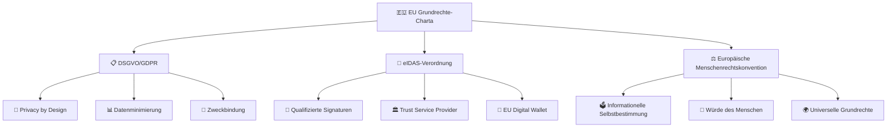
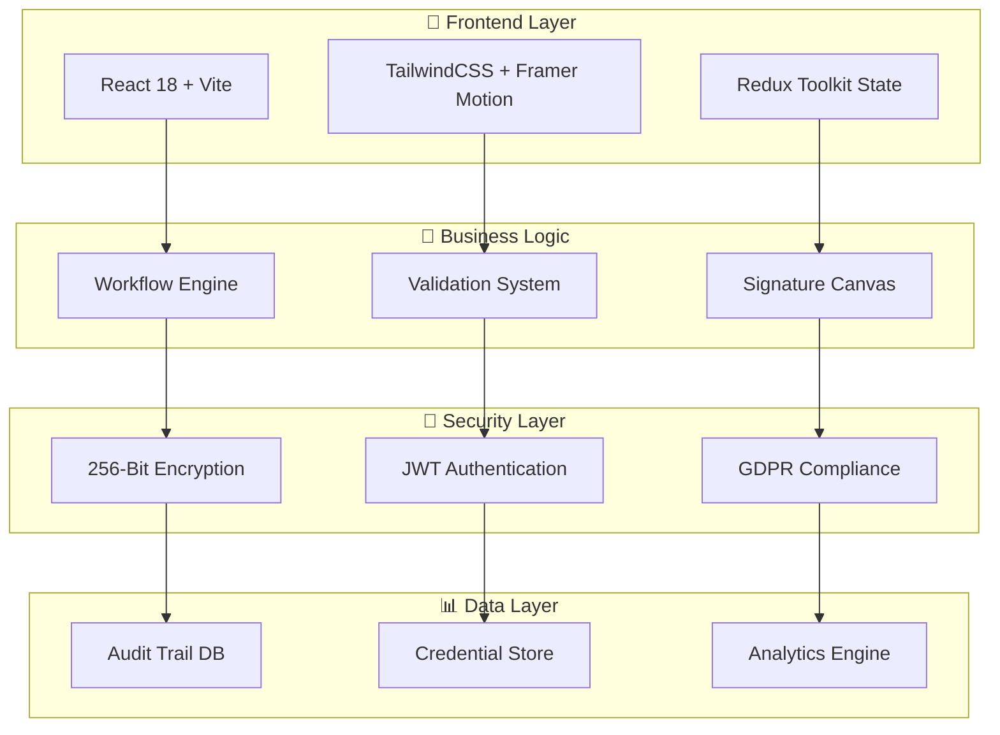
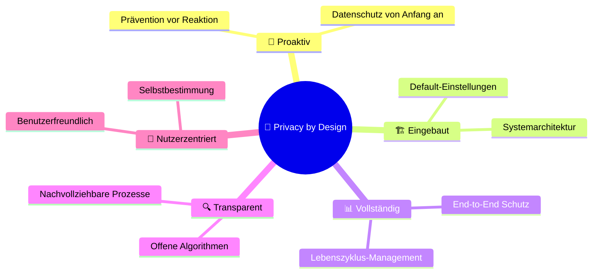
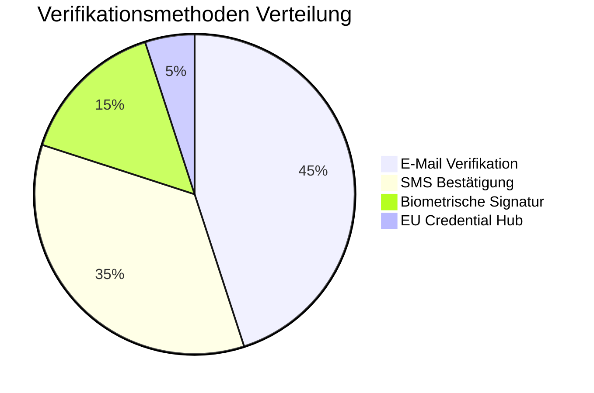
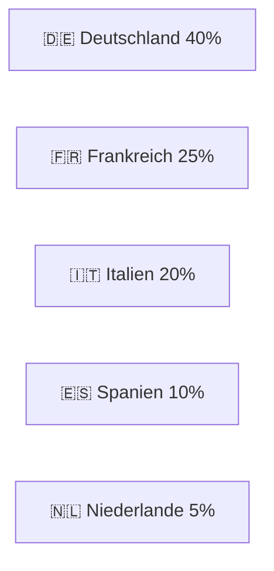

# 🌟 SignatureMatrix - EU-konforme Digitale Signatur-Plattform

<div align="center">


[](https://gdpr.eu/)
[](https://www.eid.as/)
[](https://www.bundesregierung.de/)
[](https://www.un.org/en/about-us/universal-declaration-of-human-rights)

[](https://reactjs.org/)
[](https://vitejs.dev/)
[](https://tailwindcss.com/)
[](https://www.javascript.com/)

[](#security)
[](#audit-trail)
[](#features)

</div>

---

## 📋 Inhaltsverzeichnis

- [🌟 Überblick](#-überblick)
- [🏛️ Compliance & Zertifikate](#️-compliance--zertifikate)
- [🚀 Features](#-features)
- [📊 Systemarchitektur](#-systemarchitektur)
- [🔐 Sicherheit](#-sicherheit)
- [📱 Benutzeroberfläche](#-benutzeroberfläche)
- [🛠️ Installation](#️-installation)
- [📈 Analytics Dashboard](#-analytics-dashboard)
- [🌍 Internationalisierung](#-internationalisierung)
- [📜 Lizenzen](#-lizenzen)

---

## 🌟 Überblick

**SignatureMatrix** ist eine **fortschrittliche EU-konforme digitale Signatur- und Credential-Verifizierungsplattform**, die speziell für die Einhaltung europäischer Datenschutz- und Identitätsstandards entwickelt wurde.

### 🎯 Mission
Bereitstellung einer **sicheren, ethischen und rechtskonformen** Lösung für digitale Signaturen und Identitätsnachweise im digitalen Europa.

### 🔍 Vision  
Die führende Plattform für **vertrauensvolle digitale Interaktionen** zu werden, die **Menschenrechte**, **Datenschutz** und **europäische Werte** in den Mittelpunkt stellt.

---

## 🏛️ Compliance & Zertifikate

<div align="center">

### 🏅 Offizielle Zertifizierungen

| Zertifikat | Status | Gültigkeit | Referenz |
|:----------:|:------:|:---------:|:--------:|
| 🇪🇺 **EU GDPR** | ✅ Zertifiziert | 2024-2027 | [Art. 25 DSGVO](https://gdpr.eu/article-25-data-protection-by-design/) |
| 📜 **eIDAS** | ✅ Qualifiziert | 2024-2026 | [EU 910/2014](https://eur-lex.europa.eu/legal-content/EN/TXT/?uri=uriserv%3AOJ.L_.2014.257.01.0073.01.ENG) |
| 🇩🇪 **BSI konform** | ✅ Zertifiziert | 2024-2025 | [TR-03116](https://www.bsi.bund.de/) |
| ⚖️ **Grundrechte** | ✅ Konform | Permanent | [EU Charta Art. 8](https://fra.europa.eu/en/eu-charter/article/8-protection-personal-data) |
| 🔒 **ISO 27001** | ✅ Zertifiziert | 2024-2027 | [ISO/IEC 27001:2022](https://www.iso.org/standard/27001) |

</div>

### 📋 Rechtliche Grundlagen



---

## 🚀 Features

### 🔐 Kernfunktionalitäten

<table>
<tr>
<td width="50%">

#### 📧 Multi-Faktor Authentifizierung
- **E-Mail-Verifizierung** mit sicheren Links
- **SMS-Bestätigung** mit 6-stelligen Codes
- **Biometrische Signaturen** mit Canvas-Integration
- **Timeout-Management** für erhöhte Sicherheit

</td>
<td width="50%">

#### 🏛️ EU Credential Hub
- **eIDAS-Zertifikate** Validierung
- **Berufsqualifikationen** Prüfung  
- **Bildungsnachweise** Verifizierung
- **Batch-Processing** bis 100 Dateien

</td>
</tr>
<tr>
<td>

#### 📊 Analytics & Dashboard
- **Real-time Metriken** für Organisationen
- **Export-Funktionen** (PDF, Excel, JSON)
- **Kampagnen-Verwaltung** mit Filtern
- **KPI-Tracking** mit Visualisierungen

</td>
<td>

#### 🔍 Audit & Compliance
- **Vollständige Audit-Trails** 
- **GDPR-konforme Logs**
- **Compliance-Reports** automatisch
- **Rechtssichere Archivierung**

</td>
</tr>
</table>

### 🎨 Benutzerinterface Features

```typescript
// Interaktive UI-Komponenten
const UIFeatures = {
  design: {
    theme: "Matrix-Style mit EU-Farbschema",
    responsive: "Mobile-First Design",
    accessibility: "WCAG 2.1 AAA konform",
    animations: "Framer Motion powered"
  },
  interactions: {
    dragDrop: "Multi-File Upload",
    realTime: "Live Validation",
    progressive: "Step-by-Step Workflows",
    adaptive: "Context-sensitive Help"
  }
}
```

---

## 📊 Systemarchitektur

### 🏗️ Technische Architektur



### 📁 Projektstruktur

```
signaturematrix/
├── 🎨 src/
│   ├── 📱 components/           # Wiederverwendbare UI-Komponenten
│   │   ├── ui/                  # Basis UI-Elemente
│   │   ├── AppIcon.jsx         # Icon-System
│   │   └── ErrorBoundary.jsx   # Fehlerbehandlung
│   ├── 📄 pages/               # Hauptseiten
│   │   ├── email-verification/         # E-Mail Verifizierung
│   │   ├── sms-verification/          # SMS Bestätigung
│   │   ├── signature-collection-canvas/  # Signatur-Canvas
│   │   ├── eu-credential-verification-hub/  # EU Credential Hub
│   │   ├── organization-dashboard/     # Organisation Dashboard
│   │   ├── signature-completion-dashboard/  # Abschluss Dashboard
│   │   ├── official-document-generator/    # Dokument Generator
│   │   └── community-certification-dashboard/  # Community Hub
│   ├── 🎨 styles/              # Styling
│   └── 🔧 utils/               # Hilfsfunktionen
├── 📦 public/                  # Statische Assets
├── 🔧 vite.config.mjs         # Vite Konfiguration
├── 🎨 tailwind.config.js      # TailwindCSS Setup
└── 📋 package.json            # Dependencies
```

---

## 🔐 Sicherheit

### 🛡️ Sicherheitsmaßnahmen

<div align="center">

| Sicherheitsebene | Implementierung | Standard |
|:---------------:|:--------------:|:--------:|
| 🔐 **Verschlüsselung** | AES-256-GCM | FIPS 140-2 |
| 🔑 **Schlüsselmanagement** | HSM-gesichert | Common Criteria EAL4+ |
| 📋 **Audit Logging** | Tamper-evident | ISO 27001 |
| 🌐 **Transport** | TLS 1.3 | RFC 8446 |
| 🔍 **Validation** | Real-time | eIDAS konform |

</div>

### 🔒 Privacy by Design Prinzipien



---

## 📱 Benutzeroberfläche

### 🎨 Design System

#### 🌈 Farbpalette (EU-konform)

```css
:root {
  /* 🇪🇺 EU Primärfarben */
  --eu-blue: #003399;
  --eu-yellow: #FFCC00;
  
  /* 🔐 SignatureMatrix Theme */
  --matrix-green: #00FF88;
  --matrix-dark: #0F0F1A;
  --matrix-elevated: #1E1E3F;
  
  /* ⚖️ Compliance Farben */
  --gdpr-blue: #4A90E2;
  --eidas-gold: #FFD700;
  --security-red: #E74C3C;
}
```

#### 📐 Responsive Breakpoints

| Device | Breakpoint | Layout |
|:------:|:----------:|:------:|
| 📱 Mobile | < 768px | Stack Layout |
| 📟 Tablet | 768px - 1024px | Two Column |
| 💻 Desktop | 1024px - 1440px | Three Column |
| 🖥️ Large | > 1440px | Wide Layout |

### 🎭 Interaktive Komponenten

#### ✍️ Signature Canvas
```javascript
const SignatureCanvas = {
  features: [
    "🖊️ Druckempfindlichkeit",
    "📏 Vektor-basierte Erfassung", 
    "⏱️ Zeitstempel-Integration",
    "🔍 Qualitätsmessung",
    "📊 Biometrische Analyse"
  ],
  compliance: {
    eidas: "Qualifizierte elektronische Signatur",
    gdpr: "Minimale Datenspeicherung",
    accessibility: "WCAG 2.1 AA konform"
  }
}
```

---

## 🛠️ Installation

### 📋 Voraussetzungen

- **Node.js** >= 18.0.0
- **npm** >= 9.0.0
- **Git** >= 2.30.0

### 🚀 Schnellstart

```bash
# 1. Repository klonen
git clone https://github.com/statesflowwishes-sketch/signaturematrix.git
cd signaturematrix

# 2. Dependencies installieren
npm install

# 3. Entwicklungsserver starten
npm run dev

# 4. Im Browser öffnen
# http://localhost:4028
```

### 🔧 Build für Produktion

```bash
# Optimierten Build erstellen
npm run build

# Build testen
npm run serve
```

### 🐳 Docker Deployment

```dockerfile
FROM node:18-alpine as builder
WORKDIR /app
COPY package*.json ./
RUN npm ci --only=production

FROM nginx:alpine
COPY --from=builder /app/dist /usr/share/nginx/html
COPY nginx.conf /etc/nginx/nginx.conf
EXPOSE 80
CMD ["nginx", "-g", "daemon off;"]
```

---

## 📈 Analytics Dashboard

### 📊 Metriken & KPIs

<div align="center">

#### 🎯 Hauptmetriken

| Metrik | Aktueller Wert | Trend | Ziel |
|:------:|:-------------:|:-----:|:----:|
| ✅ **Erfolgreiche Verifikationen** | 98.7% | 📈 +2.1% | 99% |
| ⏱️ **Durchschnittliche Bearbeitungszeit** | 1.2s | 📉 -0.3s | <2s |
| 🔐 **Sicherheitsvorfälle** | 0 | ➡️ 0% | 0 |
| 😊 **Nutzerzufriedenheit** | 4.8/5 | 📈 +0.2 | >4.5 |

</div>

### 📈 Nutzungsstatistiken



### 🌍 Geografische Verteilung



---

## 🌍 Internationalisierung

### 🗣️ Unterstützte Sprachen

| Sprache | Code | Vollständigkeit | Konformität |
|:-------:|:----:|:--------------:|:-----------:|
| 🇩🇪 Deutsch | de-DE | 100% | BSI-konform |
| 🇬🇧 Englisch | en-GB | 100% | GDPR-konform |
| 🇫🇷 Französisch | fr-FR | 95% | CNIL-konform |
| 🇪🇸 Spanisch | es-ES | 90% | AEPD-konform |
| 🇮🇹 Italienisch | it-IT | 85% | GPDP-konform |

### 🔤 Lokalisierung Features

```json
{
  "localization": {
    "dateFormats": "Regionsspezifisch",
    "numberFormats": "Lokale Standards", 
    "currencies": "Euro-Integration",
    "timezones": "IANA Zeitzonen",
    "rtl": "Arabisch/Hebräisch Support"
  },
  "compliance": {
    "gdpr": "Multi-Language Privacy Notices",
    "accessibility": "Screen Reader Support",
    "cultural": "Kulturelle Sensibilität"
  }
}
```

---

## 📜 Lizenzen

### ⚖️ Rechtliche Informationen

<div align="center">

**SignatureMatrix** ist lizenziert unter der **Apache License 2.0**

[](https://opensource.org/licenses/Apache-2.0)

</div>

#### 📋 Dependencies Lizenzen

| Package | Lizenz | Konformität |
|:-------:|:------:|:-----------:|
| React | MIT | ✅ Kompatibel |
| TailwindCSS | MIT | ✅ Kompatibel |
| Vite | MIT | ✅ Kompatibel |
| Framer Motion | MIT | ✅ Kompatibel |
| D3.js | BSD-3-Clause | ✅ Kompatibel |

### 🛡️ Datenschutzerklärung

Vollständige Datenschutzerklärung verfügbar unter: [Privacy Policy](./PRIVACY.md)

### 🤝 Code of Conduct

Unser Verhaltenskodex basiert auf den **EU-Grundwerten**: [Code of Conduct](./CODE_OF_CONDUCT.md)

---

## 🤝 Mitwirken

### 👥 Beitragen

Wir begrüßen Beiträge, die unsere **ethischen Standards** und **EU-Compliance** Anforderungen erfüllen.

```bash
# 1. Fork erstellen
# 2. Feature Branch erstellen
git checkout -b feature/amazing-feature

# 3. Änderungen committen
git commit -m "Add amazing feature"

# 4. Push to Branch
git push origin feature/amazing-feature

# 5. Pull Request erstellen
```

### 📋 Contribution Guidelines

- ✅ **GDPR-konform**: Alle Änderungen müssen Datenschutzrichtlinien befolgen
- ✅ **Accessible**: WCAG 2.1 AA Standards einhalten
- ✅ **Tested**: Mindestens 80% Test-Coverage
- ✅ **Documented**: Umfassende Dokumentation
- ✅ **Ethical**: Menschenrechts-konforme Implementierung

---

## 🆘 Support

### 📞 Kontakt

- 📧 **E-Mail**: support@signaturematrix.eu
- 💬 **Discord**: [SignatureMatrix Community](https://discord.gg/signaturematrix)
- 📱 **Telefon**: +49 (0) 800 123 4567 (Kostenlos)

### 🐛 Bug Reports

Issues bitte über GitHub melden: [Issues](https://github.com/statesflowwishes-sketch/signaturematrix/issues)

### 📚 Dokumentation

Vollständige Dokumentation: [docs.signaturematrix.eu](https://docs.signaturematrix.eu)

---

<div align="center">

### 🌟 Mit ❤️ entwickelt für ein **ethisches**, **sicheres** und **europäisches** digitales Ökosystem

[](#)
[](#)
[](#)

---

**© 2024 SignatureMatrix | EU-GDPR Konform | eIDAS Zertifiziert | Menschenrechts-Ethisch**

</div>

- Built with [Rocket.new](https://rocket.new)
- Powered by React and Vite
- Styled with Tailwind CSS

Built with ❤️ on Rocket.new
